<!-- Banner -->
<div align="center">



<br/>

[](https://www.linkedin.com/in/senadhi-mandina)
[](https://www.instagram.com/sena_dh1)
[](https://github.com/SenadhiMandina)

</div>

---

## 👩‍💻 About Me

```python
class Senadhi:
    def __init__(self):
        self.role     = "Computer Science Undergraduate"
        self.location = "Colombo, Sri Lanka 🇱🇰"
        self.focus    = ["Full-Stack Development", "UI/UX Design", "Problem Solving"]
        self.loves    = ["Clean code", "Pretty interfaces", "Building cool stuff"]
        self.goal     = "Become a software engineer who builds things people actually enjoy using"

    def say_hi(self):
        print("Thanks for stopping by! Let's build something together ✨")
```

- 🎓 Studying Computer Science, always curious and always learning
- 🚀 Passionate about web apps, Python projects and thoughtful design
- 🎨 I like my code clean and my interfaces cleaner
- 🤝 Open to collaborating, learning and new opportunities

---

## 🛠️ Tech Stack

<div align="center">

**Languages**


**Frameworks & Libraries**


**Database, Tools & Design**


</div>

---

## 📂 Featured Projects

<table>
  <tr>
    <td width="50%" valign="top">
      <h3>🏡 Estate Finder</h3>
      <p>A client-side React estate agent web app built for university coursework.</p>
      
      
      <br/><br/>
      <a href="https://github.com/SenadhiMandina/Estate-Finder-react-app">View Project →</a>
    </td>
    <td width="50%" valign="top">
      <h3>🚦 Traffic CSV Analyzer</h3>
      <p>Reads traffic CSV files, processes vehicle data and displays hourly histograms with Tkinter.</p>
      
      
      <br/><br/>
      <a href="https://github.com/SenadhiMandina/Traffic-CSV-Analyzer">View Project →</a>
    </td>
  </tr>
  <tr>
    <td width="50%" valign="top">
      <h3>✈️ Flight Route System</h3>
      <p>Python console app that shows all possible airline routes and the least-duration routes between countries.</p>
      
      <br/><br/>
      <a href="https://github.com/SenadhiMandina/Flight-Route-System">View Project →</a>
    </td>
    <td width="50%" valign="top">
      <h3>🌍 Climate Change Awareness</h3>
      <p>A responsive multi-page web app with interactive elements to raise awareness about climate change.</p>
      
      
      <br/><br/>
      <a href="https://github.com/SenadhiMandina/Climate-Change-Awareness-Web-Application">View Project →</a>
    </td>
  </tr>
  <tr>
    <td width="50%" valign="top">
      <h3>💙 CareGiver App Prototype</h3>
      <p>A Figma prototype showcasing the UI/UX design for a caregiver app.</p>
      
      <br/><br/>
      <a href="https://github.com/SenadhiMandina/CareGiver-App-Figma-Prototype-">View Project →</a>
    </td>
    <td width="50%" valign="top">
      <h3>❌⭕ Tic-Tac-Toe</h3>
      <p>A console-based two-player Tic Tac Toe game written in Python.</p>
      
      <br/><br/>
      <a href="https://github.com/SenadhiMandina/Tic-Tac-Toe-game-">View Project →</a>
    </td>
  </tr>
</table>

---

## 📊 GitHub Stats

<div align="center">


</div>

---

## 🌱 Currently

| | |
|---|---|
| 🔭 **Working on** | Full-stack projects with React, FastAPI and MySQL |
| 📚 **Learning** | Backend architecture, APIs and better UI/UX |
| 💬 **Ask me about** | Python, React, Figma prototypes |
| ⚡ **Fun fact** | I can debug for hours and still enjoy it 😄 |

---

<div align="center">

### 💌 Let's Connect

I'm always happy to chat about code, design or opportunities.

[](https://www.linkedin.com/in/senadhi-mandina)

<br/>

⭐ *If you like what you see, drop a star on a repo!* ⭐


</div>
